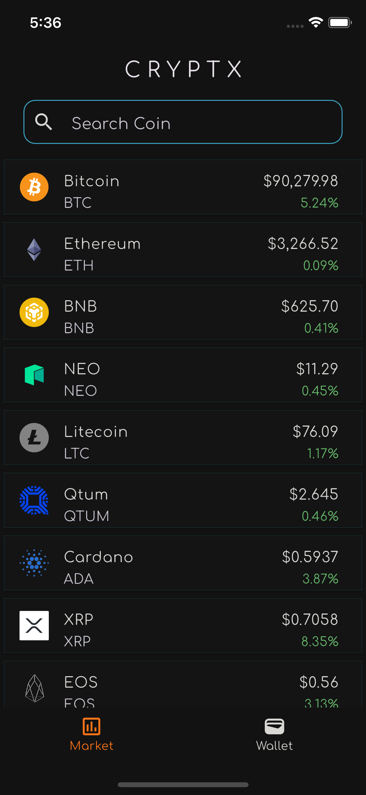
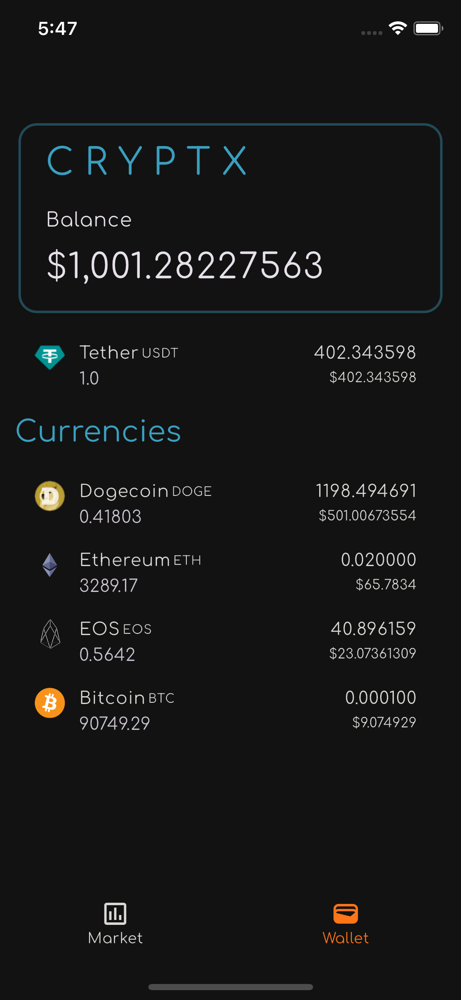

# Cryptx

Cryptx is a mobile application designed to simulate cryptocurrency trading, allowing users to practice and enhance their trading skills in a risk-free environment. Developed as the final project for the CS50 certification, Cryptx enables users to trade virtual currencies based on real-time market prices. Currently, the application supports basic trading functionalities without advanced features like margin trading, limit orders, or stop-loss orders.

## Features

- **Real-Time Market Prices:** Access up-to-date cryptocurrency market data to inform trading decisions.
- **User-Friendly Interface:** Navigate the app with ease, thanks to its intuitive design.
- **Portfolio Tracking:** Monitor your virtual assets and track trading performance over time.

## Technologies Used

- **Flutter**: Used as the main framework for building the application, ensuring a smooth and cross-platform experience.
- **Dart**: The primary programming language used with Flutter for app development.

## Getting Started

1. **Clone the Repository:**

   ```bash
   git clone https://github.com/Arjein/Cryptx.git
   ```

2. **Navigate to the Project Directory:**

   ```bash
   cd Cryptx
   ```

3. **Install Dependencies:**

   ```bash
   flutter pub get
   ```

4. **Run the Application:**

   ```bash
   flutter run
   ```

## Screenshots

<div align="center">

| Market Screen | Buy Screen |
|:-------------------------:|:-------------------------:|
|  | |

| Chart View | Portfolio Screen |
|:-------------------------:|:-------------------------:|
|  |  |
</div>

## Contributing

Contributions are welcome! If you have suggestions for new features or improvements, please open an issue or submit a pull request.

## License

This project is licensed under the MIT License. For more details, refer to the [LICENSE](https://github.com/Arjein/Cryptx/blob/main/LICENSE) file.

## Acknowledgments

Special thanks to the CS50 course instructors and community for their guidance and support throughout the development of this project.

For more information, visit the [Cryptx GitHub Repository](https://github.com/Arjein/Cryptx).
